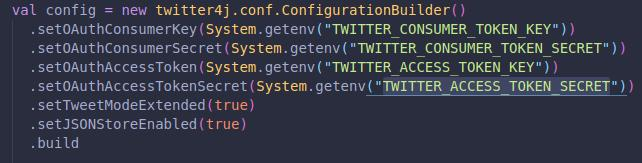
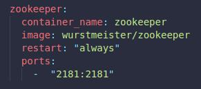
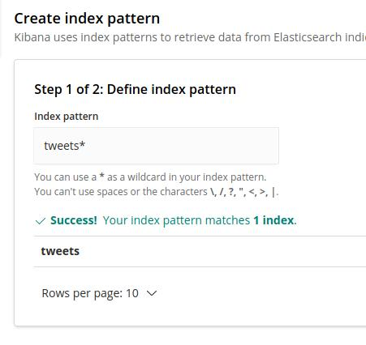

<div style="text-align: justify">

# Fazendo um pipeline usando Twitter, Flink e ElasticSearch
**Projeto criado para fazer uma implementação em scala de um dos exercícios do curso [ Apache Flink | A Real Time & Hands-On course on Flink ](https://www.udemy.com/course/apache-flink-a-real-time-hands-on-course-on-flink/). Foram adicionados algumas features a mais como filtro pela quantidade de followers, inserção no elasticsearch e filtro para tratar o json de resposta da API**

---

# Tecnologias
* Java
* Apache Flink
* Apache Kafka
* Twitter API
* ElasticSearch
* Docker
* Shell

---
# Recursos necessários
* Java 11 
* [Docker](https://www.docker.com/) e [Docker-Compose](https://docs.docker.com/compose/install/)
* [Scala](https://www.scala-lang.org/download/) (2.12.11)
* Uma conta de desenvolvedor do [Twitter](https://developer.twitter.com/en)

---
# Importante
* Após criar sua conta de desenvolvedor é necessário colocar suas keys como [variável de ambiente](https://www.todoespacoonline.com/w/2015/07/variaveis-de-ambiente-no-linux/). **Precisam ser exatamente esse nomes!** (TWITTER_CONSUMER_TOKEN_KEY, TWITTER_CONSUMER_TOKEN_SECRET, TWITTER_ACCESS_TOKEN_KEY, TWITTER_ACCESS_TOKEN_SECRET) . [1]
* Garanta que não há nenhum serviço rodando nas portas 2181, 5601, 9200 e 9092 em seu computador, caso contrário o docker não conseguirá subir as imagens, para contonar isto pode-se mudar a porta onde o docker entra na aplicação [2].

# Como executar (Linux - Ubuntu)
* Em seu terminal, navegue até a raíz do projeto e execute o comando "```./run.sh```" para começar a execução do projeto.
* Para visualizar seus dados no ElasticSearch vá até ```localhost:5601``` Discover, crie um index [3] e abra a aba discover de novo que você verá os tweets inseridos
* Para finalizar a execução do programa feche os terminais que abriram com o ```run.sh``` e na pasta raíz do projeto, abra o terminal e execute ```docker-compose down --volumes```.


---
[1] Caso não queira colocar os valores como variável de ambiente pode-se colocar somente a String no arquivo ```com.github.example.util.utils``` na parte de configuração das keys.


[2] Na tag ```ports```, o valor da esquerda é qual porta do seu computador você irá liberar para o docker mapear.


[3] Criação do index.


</div>